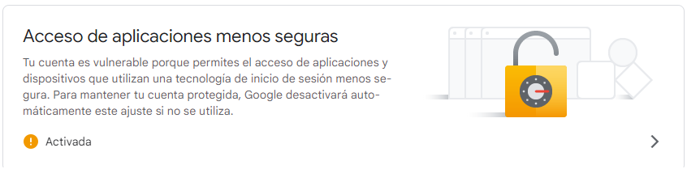

# PPI Rembry

Proyecto realizado en Python. en el framework de Django y el administrador de bases de datos postgreSQL.

### Pasos

1. Instalar los requerimientos que estan en el archivo Requirement.txt
2. Conectar la base de datos core>.env cambiar la contraseña del gestor de base de datos.
3. insertar el servidor SMTP con el correo institucional en core>setting> bajar hasta donde dice correo institucional, Claro verificar la gestión de cuenta de la seguridad de GOOGLE.

4. Hacer las migraciones
5. correr el proyecto python manage.py runserver

### Diseño

Framework de Facebook --> Tailwind

### Otras funcionalidades

1. [x] Recuperación contraseña por correo
1. [x] Verficación de correo electronico

